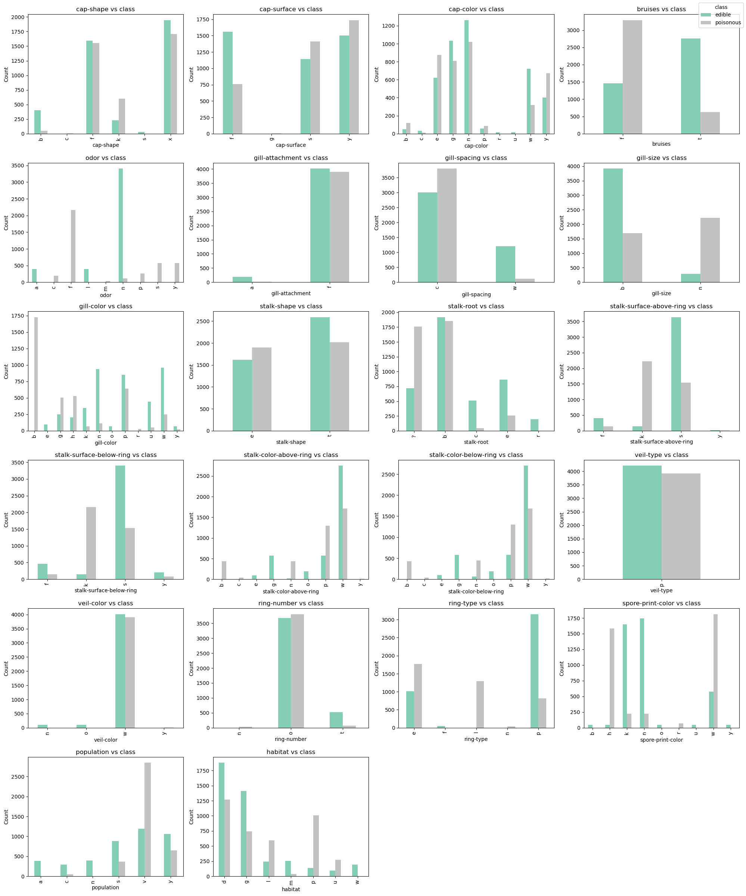
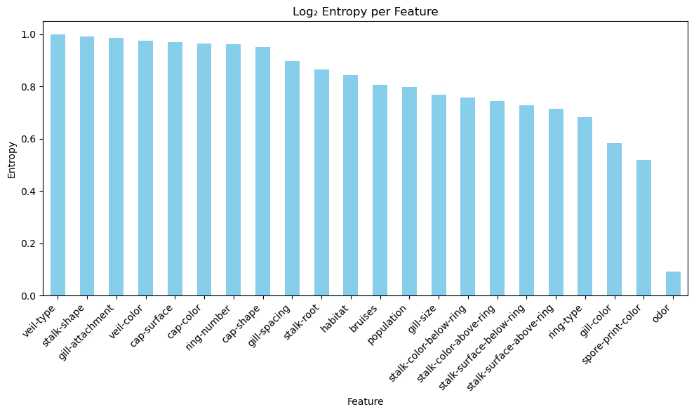
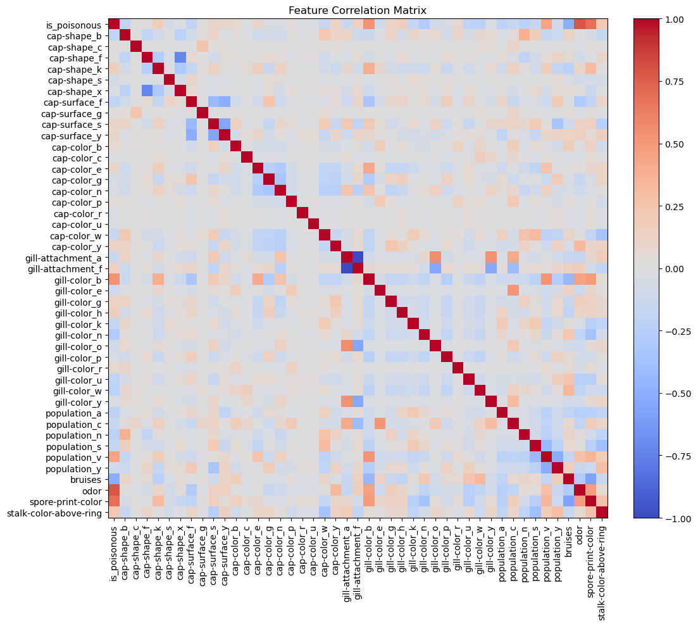
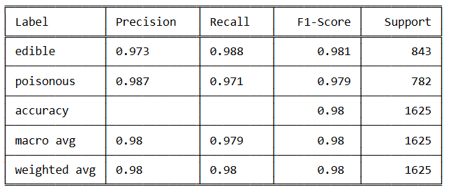
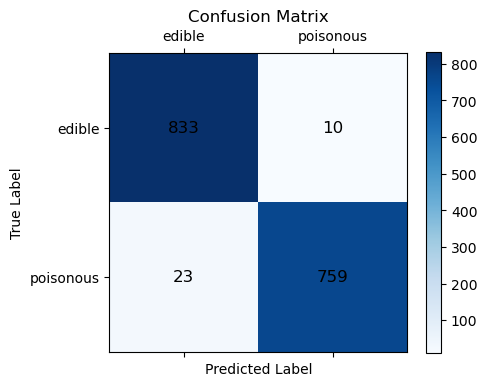
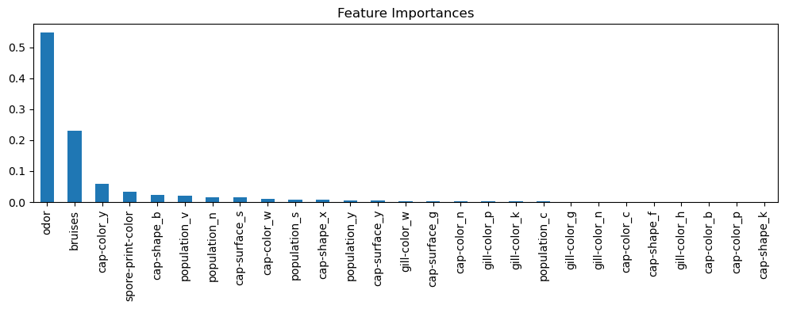
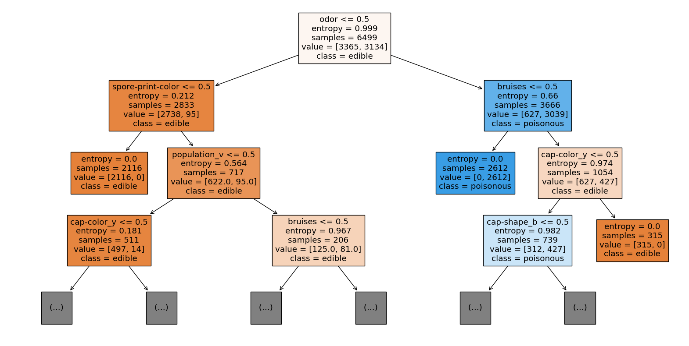

## Mushroom Classification

**Summary of project:** This repository holds my attempt at applying a decision tree and random forest to data on (gilled) mushrooms to determine if they are poisonous or not, taken from "Mushroom Classification" on Kaggle (https://www.kaggle.com/datasets/uciml/mushroom-classification) .

**Overview:** This project aims to predict the edibility of mushrooms using classification models, given that the dataset categorizes mushrooms as either edible or poisonous. Since all features in the dataset are categorical, visualizing feature distributions through histograms has been useful for identifying patterns related to edibility. Entropy analysis further helped determine which features provide the most information gain, guiding feature selection for the models. Decision Tree and Random Forest classifiers were both used, each achieving high levels of accuracy—approximately 97% for edible and 99% for poisonous classifications. 

#### Summary of Work 

---

* **Data** - Stated before all data is categorical:
    * Values inputed are single letter strings that represent the specific characterisitcs of that feature. 
    * CSV file: mushrooms.csv - 8124 entries and 22 features, minus our class 'e' or 'p' representing edible or poisonous.
    * Training: Randomly distributed 20% of data to test, while the other 80% was for training.

**Preprocessing:** I’ve ignored the one feature (stalk-root) that has missing values, and have selected the following features to one-hot encode and use for our models:

* Class
* Cap-shape
* Cap-surface
* Cap-color
* Gill-attachment
* Gill-color
* Population
* Bruises
* Odor
* Spore-print-color
* Stalk-color-above-ring

I’ve actually split these features into two separate groups. One of higher-level entropy, which I’ve one-hot encoded with pandas get.dummies, thinking due to their higher level of entropy it’d possibly be beneficial to expand each characteristic within the feature, and draw some deeper insight from each of the individual characteristics. The lower level entropy features (odor,bruises,spore-color,stalk-color) I’ve one-hot encoded only one specific characteristic, as to try and avoid bias in certain features, like odor. I was also thinking that by expanding on the higher level features it could maybe help to add 'fog' to avoid that bias. 

#### Data Visualization

* **The histograms above give a fair idea what characteristics of what features seem to correlate more with being poisonous or not.**

 

* **The entropy graph gives a better idea of which features can give the most indication of edibility. This especially makes sense with such things as odor or color.** 

* **The heatmap above visualizes the correlation matrix of the encoded features. It reinforces feature selection decisions by showing that certain variables—such as odor—exhibit strong correlations with mushroom edibility, as seen in the first row/column.** 

* **Problem Formulation:** Much of what I’ve done in preprocessing is actually our problem formulation. Choosing certain features that could give the most insight into what characteristics indicate edibility. For this I’ve used a Decision Tree and Random Forest, since both also go off of entropy as criteria.

* **Training:** There were no difficulties training, it's an easy data set, and the majority of work was choosing what features to use in training and encoding them. For training we would drop class as a feature of course. See earlier for how data was split between training and testing. 

* **Performance Comparison:** Both models are predicting the same and getting well within 100% accuracy(see table and matrices). And from what we've seen in our heatmap and entropy graph, odor is the strongest indicator for edibility. This idea is further solidified when looking at our decision graph and feature importance.

* **Conclusion:** Odor is obviously a very strong indicator for edibility in a mushroom, and that this is a very easy data set to work with. Considering this, future work could include expanding the data to not only have Agaricus/Lepiota fungi, but also mushrooms of the Morchelle(morels) and Boletus families. As gilled mushrooms are not the only edible mushroom. 

* **How to reproduce:** Decision tree, entropy-criterion, and use odor in training.

* **Overview of files used:** Was a mess and did it all in one file (Mushroom_Classification.ipynb)