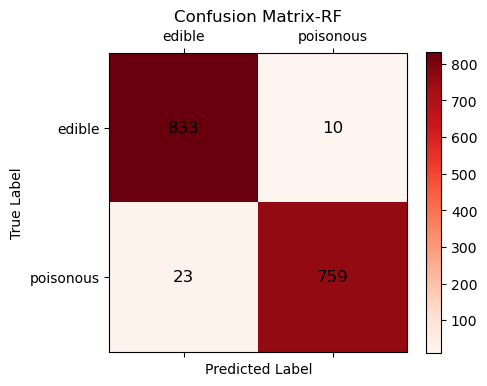

### Mushroom Classification

* **Summary of project** This repository holds my attempt at applying a decision tree and ensembling to data on (gilled) mushrooms to determine if they are poisonous or not, taken from "Mushroom Classification" on Kaggle (https://www.kaggle.com/datasets/uciml/mushroom-classification) .

* **Overview** While there are no specifics given, it is obvious we would want to try and predict the edibility of the mushrooms. Considering the entire data-set is categorical, I've histogrammed the features to get a general idea of what features show up more as poisonous or edible. Along with this I've tried to narrow it down further by plotting the entropy of each feature, as to get an idea of what features are the strongest indicators of edibility. Using both a decision tree and an ensemble (random forest), I found that both are predicting with an accruacy of 99% for poisonous mushrooms, while 97% for edible.

* **Summary of Work Done** 

* **Data** - As stated before all data is categorical. 
* Values inputed are single letter strings that represent the specific characterisitcs of that feature. 
* CSV file: mushrooms.csv - 8124 entries and 23 features, with 'e' or 'p' representing edible or poisonous.
* Training: Randomly distributed 20% of data to test, while the other 80% was for training. 

* **Preprocess** Mentioned earlier, I’ve ignored the one feature (stalk-root) that has missing values, and have selected the following features to one-hot encode and use for our models. 

-Class
-Cap-shape
-Cap-surface
-Cap-color
-Gill-attachment
-Gill-color
-Population
-Bruises
-Odor
-Spore-print-color
-Stalk-color-above-ring

I’ve actually split these features into two separate groups. One of higher-level entropy, which I’ve one-hot encoded with pandas get.dummies, thinking due to their higher level of entropy it’d possibly be beneficial to expand each characteristic within the feature, and draw some deeper insight from each of the individual characteristics. The lower level entropy features (odor,bruises,spore-color,stalk-color) I’ve one-hot encoded only one specific characteristic, as to avoid bias in certain features, like odor.

* **Data Visualization** 

-Here with the histograms we can get a fair idea of what characteristics of what features seem to correlate more with being poisonous or not. 

 

-The entropy graph above gives a better idea of which features give the most indication of edibility. This especially makes sense with such things as odor or color. 

-The heat map gives us a great visual for seeing how correlated such things as odor are with being poisonous. 

* **Problem Formulation** Much of what I’ve done in preprocessing is actually our problem formulation. Choosing certain features that could give the most insight into what characteristics indicate edibility. For this I’ve used a Decision Tree and Random Forest (an ensemble of DT’s), since both also go off of entropy as criteria.

* **Training** There were no difficulties training, the majority of work was done when choosing what features to use in training and encoding them. See earlier for how data was split between training and testing. 

* **Performance Comparison** Using a random forest with all the same features encoded, it should not come as a big surprize that both are getting well within 100% accuracy. We see this in the table below, which is the same for both the DT and RF.

We can also (below) see that both are predicting the same number of edible and poisonous mushrooms. 

-And from what we've seen in our heatmap and entropy graph, odor is the strongest indicator of edibility. This idea is further solidified when looking at our decision tree and feature importance. 

* **Conclusion** Odor is obviously a very strong indicator for edibility in a mushroom, and that this is a very easy data set to work with. Considering this, future work could include expanding the data to not only have Agaricus/Lepiota fungi, but also mushrooms of the Morchelle(morels) and Boletus families. As gilled mushrooms are not the only edible mushroom. 

* **How to reproduce** Decision tree, entropy-criterion, and use odor in training. ( Expand on this later today ) 

* **Overview of files used** Was a mess and did it all in one file (Mushroom_Classification.ipynb)